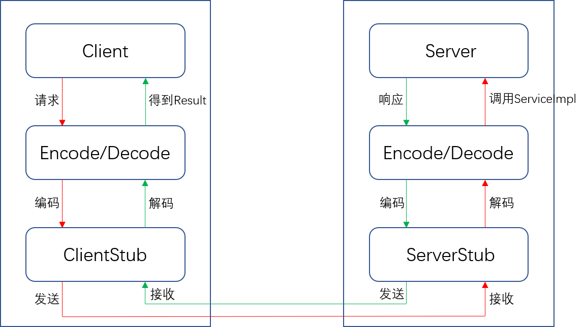

# BIO
- ServerSocket
- Socket
```
//server
Socket socket=serverSocket.accept();
socket.getInputStream().read(bytes);
//client
```
# NIO
事件监听机制
- Selector
- SelectionKey
- Channel
- Buffer
```
//阻塞式
//server
serverSocketChannel.accept();
socketChannel.read(byteBuffer);
//client
socketChannel.connect(inetSocketAddress);

//非阻塞式
//server
serverSocketChannel.configureBlocking(false);
serverSocketChannel.register(selector, SelectionKey.OP_ACCEPT);
selector.select(1000)==0//
Set<SelectionKey> selectionKeys=selector.selectedKeys();
selectionKey.isAcceptable()
SocketChannel socketChannel=serverSocketChannel.accept();//
socketChannel.configureBlocking(false);
socketChannel.register(this.selector,SelectionKey.OP_READ);
selectionKey.isReadable()
SocketChannel socketChannel=(SocketChannel)selectionKey.channel();
socketChannel.read(byteBuffer);//
//client
socketChannel.configureBlocking(false);
socketChannel.connect(inetSocketAddress)
socketChannel.write(byteBuffer);//
this.socketChannel.register(this.selector, SelectionKey.OP_READ);
this.selector.select()==0//
Set<SelectionKey> selectionKeys=this.selector.selectedKeys();
selectionKey.isReadable()
socketChannel.read(byteBuffer);//
```
# NIO易混淆方法
```
//byteBuffer.flip();说明
public final Buffer flip() {
    limit = position;
    position = 0;
    mark = -1;
    return this;
}
//byteBuffer.clear();说明
public final Buffer clear() {
    position = 0;
    limit = capacity;
    mark = -1;
    return this;
}
//byteBuffer.rewind();说明
public Buffer rewind() {
    position = 0;
    mark = -1;
    return this;
}
```
# Netty
更多细节可以查看chat包下代码
```
#server
NioEventLoopGroup: bossGroup, workerGroup
NioEventLoop(Selector, TaskQueue)
NioEventLoop(select>processSelectedKeys>runAllTasks)
processSelectedKeys(ChannelPipeline(ChannelHandlerContext(ChannelIn/OutboundHandler)))
pipeline调用，ChannelInboundHandler, ChannelOutboundHandler是两条链路
NIO的事件被封装为了ChannelHandler的方法
Future-Listener异步模型

#client
NioEventLoopGroup: group
NioEventLoop(Selector, TaskQueue)
NioEventLoop(select>processSelectedKeys>runAllTasks)
processSelectedKeys(ChannelPipeline(ChannelHandlerContext(ChannelIn/OutboundHandler)))
pipeline调用，ChannelInboundHandler, ChannelOutboundHandler是两条链路
NIO的事件被封装为了ChannelHandler的方法
Future-Listener异步模型
```
# Netty ChannelIn/OutboundHandler常用handler
```
ChannelInboundHandlerAdapter
ChannelOutboundHandlerAdapter
ByteToMessageDecoder extends ChannelInboundHandlerAdapter
ReplayingDecoder<S> extends ByteToMessageDecoder extends ChannelInboundHandlerAdapter
MessageToByteEncoder<I> extends ChannelOutboundHandlerAdapter
SimpleChannelInboundHandler<I> extends ChannelInboundHandlerAdapter
```
# Netty ChannelIn/OutboundHandler常用方法以及调用顺序
```
#server
handlerAdded
channelRegistered
bind
channelActive
read
channelRead
channelReadComplete
write
flush
channelInActive
channelUnRegistered
handlerRemoved

#client
handlerAdded
channelRegistered
connect
channelActive
read
channelRead
channelReadComplete
write
flush
channelInActive
channelUnRegistered
handlerRemoved
```
# Netty ChannelIn/OutboundHandler入站出站
```
pipeline是双向链表
出站：出pipeline，pipeline>>channel
入站：入pipeline，channel>>pipeline
```
# Netty 自定义RPC
RPC一般流程


rpc包代码流程
```
1. 启动Server(Provider)对外提供服务
- 等待Client(Customer)连接
- 解码/编码
- 校验Protocol
- 本地调用xxxServiceImpl
- 响应调用结果
2. 启动Client(Customer)远程调用服务
- !!!创建xxxServiceProxy
- 创建InvocationHandler
  -- 启动Client
  -- 设置请求数据（远程调用参数）
  -- !!!另开线程回调
  --- 发送远程调用参数（协商的Protocol）
  --- 编码/解码
  --- 等待Server(Provider)响应结果，wait
  --- 获得Server(Provider)响应结果，nofity
  --- 返回远程调用结果
```
# 参考
- 尚硅谷netty视频教程及代码